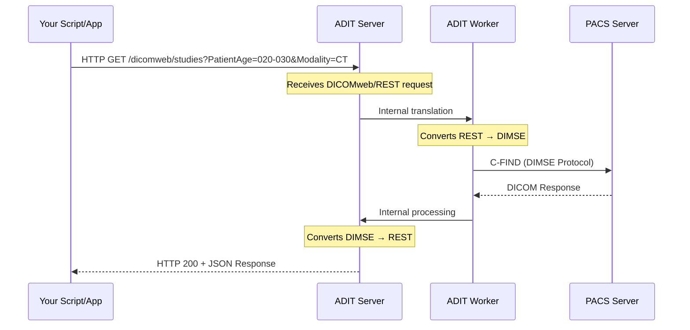

# ADIT

## About

ADIT (Automated DICOM Transfer) is a Swiss army knife to exchange DICOM data between various systems by using a convenient web frontend.

**Developed at**

<table>
  <tr>
    <td align="center"><a href="https://ccibonn.ai/"> CCIBonn.ai</a></td>
  </tr>
</table>

**in Partnership with**

<table>
  <tr>
    
  </tr>
  <tr>
    <td align="center"><a href="https://www.ukbonn.de/"> Universitätsklinikum Bonn</a></td>
    <td align="center"><a href="https://www.thoraxklinik-heidelberg.de/"> Thoraxklinik Heidelberg</a></td>
  </tr>
  <tr>
    <td align="center"><a href="https://www.klinikum.uni-heidelberg.de/kliniken-institute/kliniken/diagnostische-und-interventionelle-radiologie/klinik-fuer-diagnostische-und-interventionelle-radiologie/"> Universitätsklinikum Heidelberg</a></td>
  </tr>
</table>

> [!IMPORTANT]
> ADIT is currently in early beta stage. While we are actively building and refining its features, users should anticipate ongoing updates and potential breaking changes as the platform evolves. We appreciate your understanding and welcome feedback to help us shape the future of ADIT.

## The Challenge: Traditional DICOM vs Modern Web Workflows

Many existing PACS servers, while robust, rely on older, specialized DICOM protocols (DIMSE) and often have web-based access (like DICOMweb) either not implemented or explicitly turned off for security reasons. This creates a significant hurdle for modern applications, especially those built for the web or requiring automated, scriptable access.

## How ADIT Bridges the Gap

ADIT acts as a **translation layer** between modern web APIs and traditional DICOM protocols:

## Features

- Transfer DICOM data between DICOM-compatible servers
- Download DICOM data to a specified folder
- Pseudonymize DICOM data on the fly
- Specify a trial name for the transferred data (stored in the DICOM header)
- Easy web interface to select which studies to transfer or download
- Upload a batch file to make multiple queries on a DICOM server
- Upload a batch file to transfer or download multiple studies
- A REST API and API client to manage transfers programmatically by an external script (see below)
- Define when transfers should happen (for example, more workers at night to reduce server load on a PACS)
- Fine-grained control of what users can or can't do and what they can access
- Help modals with detailed information for the most important features
- An upload portal to upload DICOM images through a web interface that can be pseudonymized on the client (before the transfer happens)

## API Client

[ADIT Client](https://github.com/openradx/adit-client) is a Python library to query, retrieve and upload DICOM images programmatically from a Python script. Thereby it can interact with DICOM (e.g. PACS) servers connected to an ADIT server.

## Architectural overview

The backend of ADIT is built using the Django web framework, and data is stored in a PostgreSQL database. For DICOM transfer [pynetdicom](https://pydicom.github.io/pynetdicom/stable/) of the [pydicom](https://pydicom.github.io/) project is used.

A transfer job contains one or more transfer tasks that describe what studies or series to transfer. A task contains how to transfer it (source, destination, pseudonym). A transfer task is processed by a background worker running in its own Docker container and that is constantly polling queued pending tasks from the database.

When the DICOM data to transfer needs to be modified (e.g. pseudonymized) it is downloaded temporarily to the ADIT web server, then transformed and uploaded to the destination server resp. moved to the destination folder.

Downloading data from a DICOM server can done by using a DIMSE operation or by using DICOMweb REST calls. When using DIMSE operations C-GET is prioritized over C-MOVE as a worker can fetch the DICOM data directly from the server. When downloading data using a C-MOVE operation, ADIT commands the source DICOM server to send the data to a C-STORE SCP server of ADIT running in a separate container (`Receiver`) that receives the DICOM data and sends it back to the worker using a TCP Socket connection (`FileTransmitter`).

## Screenshots

## Disclaimer

ADIT is intended for research purposes only and is not a certified medical device. It should not be used for clinical diagnostics, treatment, or any medical applications. Use this software at your own risk. The developers and contributors are not liable for any outcomes resulting from its use.

## License

AGPL 3.0 or later
