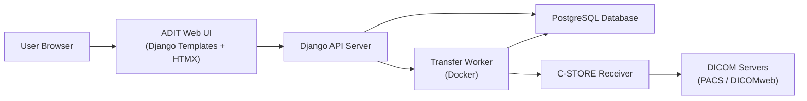
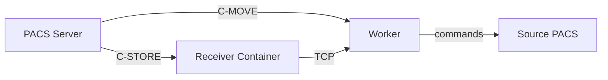
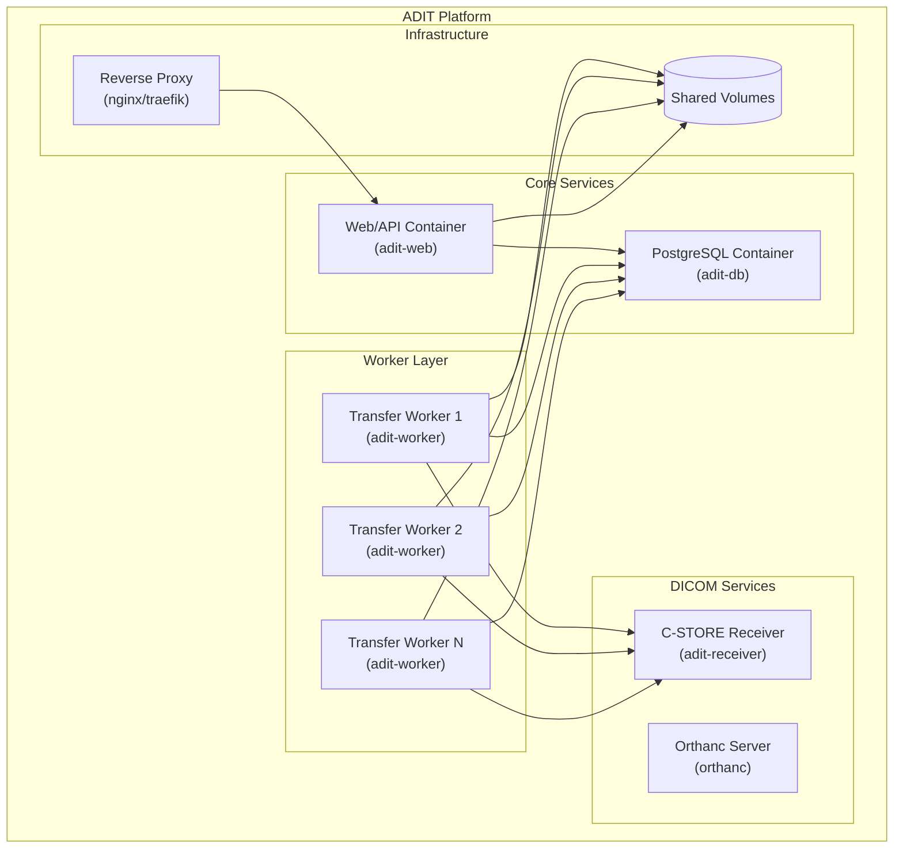

# ADIT Architecture Documentation

This document provides a comprehensive overview of ADIT's architecture, implementation details, and key components for developers.

## System Overview

ADIT (Automated DICOM Transfer) is a full-stack web application designed for automated DICOM transfers. The system consists of a Django-based backend, PostgreSQL database, and server-side rendered web interface enhanced with HTMX for dynamic interactions. It provides both web UI and programmatic API access for DICOM data management and transfer operations.

The architecture follows a task-queue pattern where transfer operations are broken down into discrete tasks, queued in the database, and processed by background workers running in separate Docker containers.

## High-Level Architecture



The ADIT platform consists of several coordinated components that together enable automated DICOM retrieval, transformation, and transfer. Users interact with ADIT through a standard web browser, initiating actions such as creating transfer jobs, uploading DICOM files configuring destinations, and monitoring job activity. The browser loads the ADIT Web UI, a server-side rendered interface built with Django templates and enhanced with HTMX for dynamic interactions—presenting dashboards, validating input, and providing seamless user experience through partial page updates and WebSocket connections. These requests are served by the Django API Server, which provides all REST endpoints and implements business logic including authentication, job orchestration, task creation, configuration handling, and interaction with the PostgreSQL database. PostgreSQL stores all persistent system data such as user accounts, transfer jobs, DICOM query results logs, and configuration, and is regularly polled by Transfer Workers for tasks requiring execution. Transfer Workers, typically running in Docker containers, perform the actual data operations: querying remote DICOM servers, retrieving images via C-GET, C-MOVE, or DICOMweb applying pseudonymization or transformation rules, sending images to destinations, and updating task status. For workflows involving C-MOVE, ADIT also runs a C-STORE Receiver which accepts inbound DICOM objects from PACS, forwards them reliably to the Transfer Worker, and ensures lossless data flow. External DICOM systems such as PACS, VNAs, and DICOMweb servers function as the data sources and sinks, providing and receiving DICOM objects through standard DIMSE and DICOMweb protocols.

## Backend Architecture

### Web/API Server Layer

The backend is built using Django, which acts as the central coordination engine for the platform. It provides REST API endpoints, handles authentication, and manages all persistent data operations. Django serves static assets and orchestrates background task execution.

Key responsibilities include:

Managing users, sessions, and permissions

Exposing API endpoints to the frontend and external systems

Creating job and task records in PostgreSQL

Performing validation and business logic

Scheduling background work for transfer workers

## Database Integration

Django communicates directly with PostgreSQL, which acts as the system of record.
The database stores all job states, study metadata, transfer logs, and configuration needed for workers to operate.

PostgreSQL maintains:

User accounts and access policies

Transfer job definitions and states

DICOM node configuration (AET, IPs, ports)

Task queue entries and execution history

Query results and study metadata extracted from PACS

## Background Processing Layer

The background processing environment consists of multiple worker containers responsible for executing DICOM operations.
These workers continuously poll the database for tasks, perform network transfers, and update progress for the UI.

Transfer workers handle:

C-GET, C-MOVE, and DICOMweb retrieval

File transformations such as pseudonymization

Streaming incoming files from C-STORE receiver

Retrying failed tasks with configurable backoff

Writing detailed logs back into PostgreSQL

## Task Queue Architecture

The system uses a PostgreSQL-backed queue. The Django API inserts tasks into job tables, and workers claim tasks atomically to avoid duplicate processing.

The queue workflow:

API inserts job + tasks

Workers poll the task table

A worker claims a task using atomic DB locks

Task is executed

Worker updates the status (completed/failed)

Workflows proceed to the next task

This ensures safe, consistent job execution even across multiple workers.

### Procrastinate Task Queue System

ADIT uses Procrastinate as its PostgreSQL-based task queue system, providing robust asynchronous job processing with advanced features for reliability and monitoring.

#### Procrastinate Architecture

**Task Definition and Registration**:

- Tasks are defined as Python functions with decorators
- Jobs are serialized and stored directly in PostgreSQL tables
- No external message broker required (Redis, RabbitMQ, etc.)
- Type-safe task parameters using Python type hints

**Queue Management Features**:

- **Job Scheduling**: Support for delayed execution and cron-like scheduling
- **Job Prioritization**: Tasks can be assigned priority levels for execution order
- **Retry Logic**: Configurable retry attempts with exponential backoff
- **Job Cancellation**: Ability to cancel queued or running jobs
- **Dead Letter Queue**: Failed jobs after max retries are moved to a separate queue

**Worker Process Management**:

- **Multiple Workers**: Scale horizontally by running multiple worker processes
- **Worker Pools**: Each worker can handle multiple concurrent tasks
- **Graceful Shutdown**: Workers complete current tasks before stopping
- **Health Monitoring**: Built-in health checks and worker status reporting

#### ADIT-Specific Procrastinate Implementation

**Transfer Task Types**:

- `process_dicom_task`: Core DICOM transfer operations for all transfer types
- `check_disk_space`: Periodic monitoring of available disk space
- `retry_stalled_jobs`: Automatic recovery of stalled Procrastinate jobs
- `broadcast_mail`: Email notifications to users and administrators

**Task Flow Management**:

```text
Django API ──(enqueue)──→ Procrastinate ──(poll)──→ Worker Container
     │                        │                         │
     └──(status updates)──────┘                         │
                                                         │
PostgreSQL ←──(progress/results)─────────────────────────┘
```

**Configuration and Monitoring**:

- **Task Timeouts**: Configurable per-task execution limits
- **Concurrency Control**: Limit concurrent tasks per worker
- **Job History**: Complete audit trail of all task executions
- **Metrics Integration**: Prometheus/Grafana compatible metrics

## DICOM Transfer Implementation

The DICOM transfer system supports multiple communication protocols and flexible data-flow patterns to accommodate both direct and transform-based workflows. It is designed to integrate with PACS environments using traditional DIMSE operations as well as modern DICOMweb services.

Protocol Support

ADIT enables several transfer mechanisms, each suited for different infrastructure needs:

C-GET Operations – Direct pull of DICOM objects from the source PACS (preferred when supported).

C-MOVE Operations – Indirect transfers using a dedicated C-STORE receiver.

DICOMweb REST API – HTTP-based retrieval for systems exposing WADO-RS/QIDO-RS/ STOW-RS.

C-STORE – Used by the receiver component to ingest pushed DICOM datasets.

### Data Pipeline Flow

The system can operate in two primary modes depending on whether processing or anonymization occurs:

Direct Transfer Path

Source → Worker → Destination

Optimal for unmodified, pass-through DICOM data.

Transform Pipeline

Source → Worker Storage → Transform Step → Destination → Cleanup

Used when transformations, validations, or anonymization are required.

### C-MOVE Receiver Architecture

When operating in C-MOVE mode, ADIT routes data through a specialized receiver process. The interaction follows this structure:



In this architecture, the Receiver Service functions as a C-STORE SCP and provides:

Reliable acceptance of incoming DICOM objects from the source PACS

Streaming of received files back to the worker over a TCP socket

Integration with the FileTransmitter for high-throughput, low-overhead data streaming

Support for multiple simultaneous C-STORE associations and concurrent transfers

## Data Transformation Layer

The data transformation layer is responsible for modifying DICOM objects when pseudonymization, anonymization, or other tag-level changes are required. This layer operates within the worker component and ensures that any sensitive information is handled securely and consistently. When a job includes transformation rules, the system switches from a direct streaming model to a controlled, file-based pipeline to guarantee data integrity and traceability.

### Pseudonymization Pipeline

When the system must modify incoming DICOM files, it performs a structured sequence of steps:

### Temporary Download

The worker retrieves DICOM instances and stores them in a secure, temporary directory on the ADIT server.

### Transformation Execution

Using pydicom, the worker applies transformations such as anonymization, pseudonymization, or tag rewriting.

### Integrity Validation

After modification, the system verifies that the DICOM structure remains valid and compliant.

### Upload to Destination

The processed data is then transferred to the final destination PACS or storage target.

### Secure Cleanup

Temporary storage is sanitized and deleted to ensure no PHI residue remains on the server.

## Supported Transformations

ADIT's transformation pipeline supports various DICOM modifications through pydicom integration:

**DICOM Tag Anonymization/Pseudonymization**:
Removal or substitution of identifying fields using pydicom's anonymization capabilities and configurable anonymization seeds.

**Patient ID Remapping**:
Mapping original identifiers to consistent pseudonyms or study-specific IDs using the ANONYMIZATION_SEED configuration.

**UID Regeneration**:
Automatic creation of new Study, Series, or Instance UIDs to avoid collisions or preserve anonymity using pydicom's UID generation.

**Custom Tag Modifications**:
Flexible transformations through DICOM modifier functions that can be applied during transfer operations, allowing for custom business logic.

## Orthanc Integration

ADIT integrates with Orthanc, an open-source DICOM server, to provide enhanced DICOM storage, processing, and web-based access capabilities. Orthanc serves as both a development tool and a production component for certain ADIT deployments.

### Orthanc as DICOM Server

**Core Capabilities**:

- **DICOM Storage**: Acts as a lightweight PACS for development and testing
- **Protocol Support**: Full DIMSE (C-FIND, C-MOVE, C-GET, C-STORE) implementation
- **DICOMweb Services**: Built-in WADO-RS, QIDO-RS, and STOW-RS endpoints
- **Web Interface**: Browser-based DICOM viewer and management interface

**ADIT Integration Points**:

- **Development Environment**: Bundled Orthanc instance for local development
- **Testing Backend**: Automated tests use Orthanc as mock PACS
- **Reference Implementation**: Demonstrates DICOM protocol compliance
- **Destination Target**: Can serve as transfer destination for testing

### Orthanc Configuration in ADIT

**Docker Compose Integration**:

```yaml
orthanc1:
  image: jodogne/orthanc-plugins:1.12.9
  hostname: orthanc1.local
  ports:
    - "7501:7501" # DICOM port
    - "6501:6501" # HTTP port
  configs:
    - source: orthanc1_config
      target: /etc/orthanc/orthanc.json
  volumes:
    - orthanc1_data:/var/lib/orthanc/db
```

**Configuration Features**:

- **AE Title Configuration**: Customizable Application Entity settings
- **Storage Backend**: PostgreSQL or SQLite database options
- **Plugin Architecture**: Extensible with DICOMweb and other plugins
- **Security Settings**: Authentication and access control configuration

### Development Workflow with Orthanc

**Local Development Setup**:

1. **Mock PACS**: Orthanc provides a complete PACS environment
2. **Test Data Upload**: Sample DICOM files can be uploaded via web interface
3. **Transfer Testing**: ADIT can query and transfer from local Orthanc
4. **Protocol Validation**: Verify DIMSE and DICOMweb implementations

**Integration Testing**:

- **Automated Tests**: Use Orthanc as source and destination for transfers
- **Protocol Compliance**: Validate C-FIND, C-MOVE, and C-GET operations
- **Performance Testing**: Measure transfer speeds and concurrent connections
- **Error Handling**: Test timeout, retry, and failure scenarios

## Frontend Architecture

The ADIT frontend is designed to provide an intuitive user experience for managing DICOM transfers, browsing studies, and interacting with the system through a modern web interface. It consists of a client-side application built with standard web technologies and a REST API layer that enables both human and programmatic access.

### Web User Interface

ADIT uses a server-side rendered web interface built with Django templates and enhanced with HTMX for dynamic interactions. The frontend emphasizes simplicity and maintainability while providing a responsive user experience for DICOM data management.

### Technology Stack

**Server-Side Rendering**: Django templates with template inheritance for clean, maintainable HTML

**Dynamic Interactions**: HTMX for partial page updates, modals, and asynchronous requests without heavy JavaScript frameworks

**CSS Framework**: Bootstrap 5 for responsive design and consistent UI components

**JavaScript Libraries**: Minimal vanilla JavaScript with Alpine.js for specific interactive components

**Static Assets**: Vendor libraries (Bootstrap, HTMX, Alpine.js) served via Django's staticfiles system

### Key Features

Interactive browser for inspecting DICOM studies

Configuration panels to create and manage transfer jobs

File upload interface for direct ingestion of DICOM datasets

Live status updates showing job progress and transfer metrics

User and role management for access control and permissions

## REST API Architecture

The REST API forms the communication backbone of ADIT, enabling both the web frontend and external tools to perform operations consistently. It adheres to standard API design principles to ensure stability, clarity, and interoperability.

### API Design

RESTful endpoint structure covering all core system capabilities

JSON used for all input/output payloads

Authentication supported via sessions or token-based mechanisms

Robust error handling with well-defined HTTP status codes

Rate limiting and request validation to ensure reliability and security

### ADIT Client Library

**ADIT Client** is a separate Python package (`adit-client`) that provides programmatic access to ADIT's REST API:

- **Scripted Operations**: Enables automated DICOM queries, transfers, and batch operations
- **API Integration**: Uses the same REST endpoints as the web interface
- **DICOM Support**: Returns pydicom datasets for seamless integration with DICOM workflows
- **Authentication**: Token-based authentication for secure API access
- **Documentation**: Comprehensive examples and usage patterns for system integration

## Docker Container Architecture

ADIT employs a multi-container Docker architecture that provides service isolation, scalability, and consistent deployment across environments. The containerized design allows for independent scaling of components and simplified dependency management.

### Container Overview

ADIT typically runs with the following container types in a production deployment:



### Core Service Containers

#### Web/API Container (`adit-web`)

**Purpose**: Hosts the Django application serving both web UI and REST API

**Configuration**:

- **Base Image**: Python 3.13 (production), Python 3.14 (development) with Django dependencies
- **Exposed Ports**: 8000 (HTTP), optionally 8443 (HTTPS)
- **Environment**: Production/development configuration via environment variables
- **Health Checks**: HTTP endpoint monitoring for container orchestration

**Responsibilities**:

- Serve Django templates and static assets
- Process API requests and authentication
- Enqueue background tasks via Procrastinate
- Database connection management

#### PostgreSQL Container (`adit-db`)

**Purpose**: Primary database for all persistent data

**Configuration**:

- **Base Image**: PostgreSQL 17 with extensions
- **Exposed Ports**: 5432 (PostgreSQL)
- **Persistent Storage**: Docker volume for data persistence
- **Backup Strategy**: Automated dumps and point-in-time recovery

**Database Extensions**:

- **Procrastinate Tables**: Task queue storage
- **DICOM Metadata**: Optimized indexes for study queries
- **Audit Logging**: Transfer history and user actions

### Worker Container Layer

#### Transfer Worker Containers (`adit-worker`)

**Purpose**: Execute DICOM transfer tasks and background processing

**Scaling Strategy**:

- **Horizontal Scaling**: Deploy multiple worker instances
- **Resource Allocation**: CPU and memory limits per container
- **Auto-scaling**: Scale based on queue depth and system load

**Container Configuration**:

- **Base Image**: Same as web container with additional DICOM tools
- **No Exposed Ports**: Workers communicate via database and internal networks
- **Shared Storage**: Access to temporary file storage for transformations
- **Process Management**: Procrastinate worker process with configurable concurrency

**Worker Types and Specialization**:

- **General Workers**: Handle standard transfer operations
- **High-Memory Workers**: For large dataset processing and transformations
- **Specialized Workers**: Dedicated to specific PACS or protocols

### DICOM Service Containers

#### C-STORE Receiver Container (`adit-receiver`)

**Purpose**: Accept incoming DICOM data from C-MOVE operations

**Configuration**:

- **Base Image**: Python 3.13 with pynetdicom and DICOM libraries
- **Internal Ports**: 11112 (DICOM C-STORE SCP), 14638 (File Transmit TCP)
- **External Ports**: 11122:11112 (development mapping)
- **Network**: Internal communication with worker containers via service discovery
- **File Streaming**: High-performance TCP socket connections to transfer workers

**Operational Features**:

- **High Availability**: Multiple receiver instances for load distribution
- **Connection Pooling**: Efficient handling of concurrent C-STORE associations
- **Error Recovery**: Automatic retry and failover mechanisms

#### Orthanc Container (`orthanc`)

**Purpose**: Development PACS and DICOMweb services

**Configuration**:

- **Base Image**: Official Orthanc Docker image
- **Exposed Ports**: 7501/7502 (DICOM), 6501/6502 (HTTP/DICOMweb)
- **Storage**: PostgreSQL backend for production, SQLite for development
- **Plugins**: DICOMweb, authentication, and storage plugins

### Infrastructure Containers

#### Reverse Proxy Container (`nginx`/`traefik`)

**Purpose**: Load balancing, SSL termination, and routing

**Features**:

- **SSL/TLS**: Certificate management and HTTPS enforcement
- **Load Balancing**: Distribute requests across web container instances
- **Static Files**: Efficient serving of CSS, JS, and image assets
- **Health Checks**: Route traffic only to healthy containers

### Container Orchestration

#### Docker Compose Configuration

**Development Environment**:

```yaml
version: "3.8"
services:
  web:
    image: adit_dev:latest
    ports:
      - "${WEB_DEV_PORT:-8000}:8000"
      - "${REMOTE_DEBUGGING_PORT:-5678}:5678"
    command: >
      bash -c "wait-for-it -s postgres.local:5432 -t 60 && 
               ./manage.py migrate &&
               ./manage.py runserver 0.0.0.0:8000"
    hostname: web.local

  default_worker:
    image: adit_dev:latest
    command: ./manage.py bg_worker -l debug -q default --autoreload
    hostname: default_worker.local

  dicom_worker:
    image: adit_dev:latest
    command: ./manage.py bg_worker -l debug -q dicom --autoreload
    hostname: dicom_worker.local

  receiver:
    image: adit_dev:latest
    command: ./manage.py receiver --autoreload
    ports:
      - "11122:11112" # External:Internal port mapping
    hostname: receiver.local

  postgres:
    image: postgres:17
    hostname: postgres.local
    ports:
      - "${POSTGRES_DEV_PORT:-5432}:5432"
    volumes:
      - postgres_data:/var/lib/postgresql/data

  orthanc1:
    image: jodogne/orthanc-plugins:1.12.9
    hostname: orthanc1.local
    ports:
      - "7501:7501"

  orthanc2:
    image: jodogne/orthanc-plugins:1.12.9
    hostname: orthanc2.local
    ports:
      - "7502:7502"
```

**Production Deployment**:

- **Container Orchestration**: Kubernetes or Docker Swarm for advanced features
- **Service Mesh**: Istio or similar for advanced networking and observability
- **Monitoring**: Prometheus, Grafana, and log aggregation
- **Backup Strategy**: Automated database backups and disaster recovery

#### Resource Management

**Resource Allocation**:

- **Web Container**: 2 CPU cores, 4GB RAM (baseline)
- **Worker Containers**: 1-2 CPU cores, 2-8GB RAM (depending on workload)
- **Database Container**: 4+ CPU cores, 8+ GB RAM, SSD storage
- **Receiver Container**: 1 CPU core, 1GB RAM (lightweight)

**Storage Requirements**:

- **Database Volume**: Persistent storage for PostgreSQL data
- **Temporary Storage**: Shared volume for DICOM file transformations
- **Log Storage**: Centralized logging with retention policies
- **Backup Storage**: Regular database and configuration backups

#### Networking Architecture

**Internal Networks**:

- **Backend Network**: Web, workers, and database communication
- **DICOM Network**: Receiver and external PACS communication
- **Frontend Network**: Reverse proxy and web container

**Security Considerations**:

- **Network Isolation**: Containers communicate only through defined networks
- **Secrets Management**: Database credentials and API keys via Docker secrets
- **Image Security**: Regular base image updates and vulnerability scanning
- **Runtime Security**: Non-root user execution and read-only containers where possible

## Technology Stack Details

The ADIT platform is built on a modern, modular technology stack that supports scalable backend processing, robust DICOM handling, and a streamlined web-based frontend. Each layer of the system is designed to maximize reliability, performance, and maintainability.

### Backend Framework

The backend is powered by Django and Python, providing a strong foundation for database-backed operations, asynchronous processing, and clean API design. These technologies ensure predictable behavior in production and maintainable code for long-term development.

Django 5.1.6+ – Serves as the primary web framework, offering MVC structure, ORM capabilities, built-in admin tools, and strong security features.

Python 3.12+ – Leverages modern language features, improved performance, and first-class async support. Development containers use Python 3.14 for future compatibility.

PostgreSQL 17 – Used as the main relational database, ensuring reliability, consistency, and robust transactional behavior.

Procrastinate – Provides the backend task queue that powers asynchronous job execution, such as DICOM transfers and processing.

Docker – Ensures consistent deployment environments across development, testing, and production. Production images use Python 3.13 with uv for dependency management.

### DICOM Integration

DICOM operations are handled through a combination of community-standard libraries and custom tooling. This allows ADIT to perform complex transfers, apply pseudonymization, and communicate with PACS systems using established protocols.

pydicom – Enables safe parsing, inspection, and manipulation of DICOM datasets.

pynetdicom – Implements DIMSE networking (C-FIND, C-MOVE, C-STORE) required for PACS interoperability.

DICOMweb – Adds support for modern REST-based DICOM endpoints used by newer systems.

Custom utilities – Handle advanced functionality like pseudonymization, validation workflows, and optimized transfer logic.

### Frontend Technology

ADIT's frontend architecture prioritizes simplicity, maintainability, and progressive enhancement. Rather than using complex JavaScript frameworks, it leverages server-side rendering with carefully selected client-side enhancements.

**Django Templates**: Server-side rendered HTML with template inheritance, includes, and custom template tags for reusable components.

**HTMX**: Enables dynamic partial page updates, form submissions, and real-time interactions without full page reloads.

**Alpine.js**: Lightweight reactive JavaScript framework for specific interactive components like form handling and dynamic UI elements.

**Bootstrap 5**: CSS framework providing responsive grid system, components, and utility classes.

**WebSocket Integration**: Real-time updates for transfer progress using HTMX WebSocket extensions.

**Static Asset Management**: Vendor libraries managed through Django's staticfiles with custom CLI commands for dependency updates.

## Application Architecture

### Core Django Apps Structure

#### **Core App** (`adit.core`)

- **Purpose**: Foundation services and shared components
- **Components**: User management, DICOM node configuration, base models, utilities
- **Key Features**: Authentication, authorization, DICOM server management

#### **Transfer Apps**

- **Batch Transfer** (`adit.batch_transfer`): Bulk data transfer operations
- **Selective Transfer** (`adit.selective_transfer`): Individual study transfers
- **Batch Query** (`adit.batch_query`): Bulk DICOM server queries

#### **Exploration & Discovery**

- **DICOM Explorer** (`adit.dicom_explorer`): Interactive DICOM data browsing
- **DICOM Web** (`adit.dicom_web`): RESTful DICOM services interface

#### **Upload System** (`adit.upload`)

- **File Upload**: Direct DICOM file upload to ADIT
- **Batch Processing**: Bulk file import and processing
- **Validation**: DICOM compliance and integrity checking

## Data Architecture

The ADIT data layer models users, DICOM endpoints, transfer workflows, and cached study metadata. Using Django’s ORM, the system ensures relational consistency, auditability, and scalable workflow execution.

---

## Primary Models

### User Management

User-related models extend Django’s built-in authentication system to support DICOM-specific workflows.

- **Users & Groups** – Standard authentication with custom role definitions
- **Permissions** – Fine-grained access control for PACS and transfer operations
- **Profile Extensions** – Additional metadata fields for workflow-specific needs

### DICOM Infrastructure

Models defining connectivity and capability information for external PACS systems.

- **DICOM Nodes** – AE Titles, IP/port, and supported service classes
- **Connection Profiles** – Authentication and protocol settings
- **Server Capabilities** – Supported DIMSE and DICOMweb operations

### Transfer Operations

Models responsible for describing, tracking, and auditing transfers.

- **Transfer Jobs** – High-level transfer definitions
- **Transfer Tasks** – Atomic operations for study/series/instance transfer
- **Task Status** – Structured progress and error tracking
- **Transfer History** – Logs and audit trails for completed operations

### Study Management

Cached metadata for efficient querying and validation.

- **Study Metadata** – Basic cached DICOM study-level information
- **Series Tracking** – Individual series belonging to each study
- **Instance Management** – Instance-level tracking and operations

---

## Authentication & Authorization

ADIT uses Django’s security model combined with custom rules for DICOM-specific access control.

### Security Model

- **Django Auth System** – Core authentication with extensions
- **Group-based Permissions** – Role-based access control
- **DICOM Node Access** – User-level restrictions for PACS endpoints
- **Session Management** – Secure sessions with configurable timeout

### Access Control

- **Operation-level Permissions** – Controls who can run transfers
- **Data Access Restrictions** – Limits visibility to specific studies or nodes
- **Audit Logging** – Tracks sensitive actions and data access events

---

## Performance & Scalability

The system is engineered for high-volume and high-concurrency DICOM data processing.

### Asynchronous Processing

- **Background Jobs** – Offloads time-consuming tasks
- **Worker Scaling** – Horizontal scaling for high throughput
- **Queue Management** – Efficient distribution via Procrastinate
- **Resource Optimization** – Balanced memory and storage usage

### Database Optimization

- **Connection Pooling** – Improves query efficiency
- **Query Optimization** – Indexed and optimized queries
- **Data Partitioning** – Scalable long-term storage strategies
- **Cleanup Processes** – Automatic removal of old logs and temporary data

### Monitoring & Observability

- **Transfer Status Tracking** – Real-time job/task updates
- **Performance Metrics** – Throughput and reliability indicators
- **Error Handling** – Structured exception logging
- **Health Checks** – Ensures all components remain operational

---

## Development & Deployment

A containerized architecture supports reproducible environments and scalable deployments.

### Containerization Strategy

- **Multi-container Architecture** – Web, worker, and database isolation
- **Docker Compose** – Unified orchestration for dev and prod
- **Environment Configuration** – Environment-variable based settings
- **Volume Management** – Persistent storage for DB and temp files

### API Integration Points

- **External PACS Integration** – Full DICOM protocol support
- **DICOMweb Services** – REST-based imaging operations
- **Client Libraries** – Python SDK with examples
- **Webhook Support** – Event-driven integrations

---

This structure provides a scalable, secure, and extensible foundation for ADIT’s DICOM data exchange workflows.
