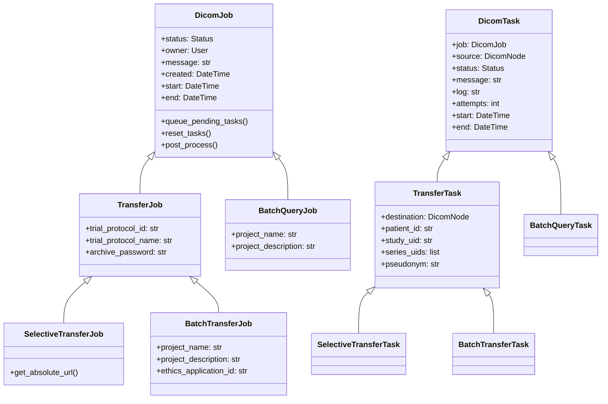
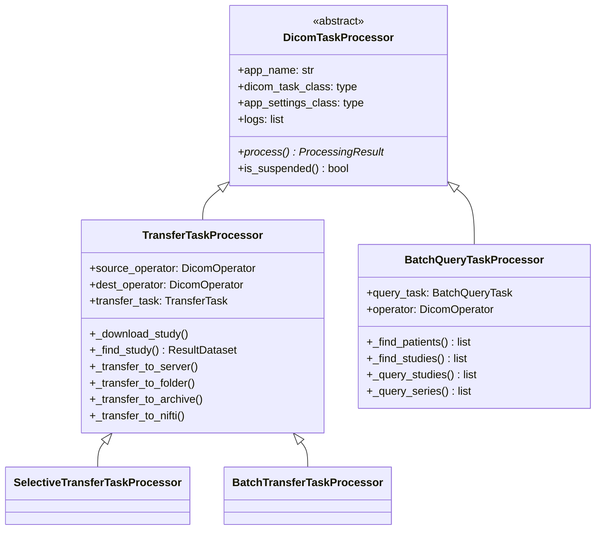
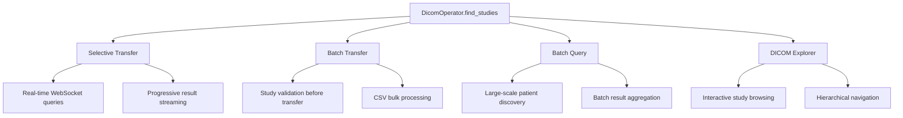
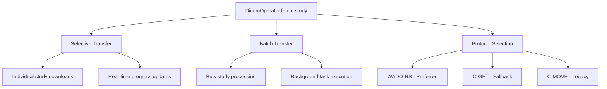

# Core Architecture & Component Hierarchy in ADIT

This document outlines the hierarchical architecture of the ADIT system, focusing on how core components are shared and reused across different applications (Selective Transfer, Batch Transfer, and Batch Query).

## Overview

The ADIT system follows a hierarchical architecture with the **Core App** (`adit.core`) providing foundational services and shared components. The core includes user management, DICOM node configuration, base models, utilities, and the critical `DicomOperator` for all DICOM operations.

## Core Component Hierarchy

### 1. Model Inheritance Structure

The core provides base models that establish a consistent pattern across all DICOM applications:



**Key Benefits:**

- **Unified Job Management**: All apps use the same job lifecycle (pending → in-progress → success/failure)
- **Consistent Task Processing**: Shared status tracking, retry logic, and error handling
- **Common Admin Interface**: Single admin interface for all job types through inheritance

### 2. DicomOperator - The Core DICOM Communication Hub

The `DicomOperator` class is the **central abstraction** for all DICOM operations, providing a unified interface regardless of the underlying protocol (DIMSE, DICOMweb).

#### DicomOperator Core Methods

```python
class DicomOperator:
    def __init__(self, server: DicomServer, dimse_timeout: int = 60):
        """Initializes operator with server configuration"""

    # Query Operations - Used by ALL apps
    def find_patients(self, query: QueryDataset) -> Iterator[ResultDataset]
    def find_studies(self, query: QueryDataset) -> Iterator[ResultDataset]
    def find_series(self, query: QueryDataset) -> Iterator[ResultDataset]
    def find_images(self, query: QueryDataset) -> Iterator[ResultDataset]

    # Retrieval Operations - Used by Transfer apps
    def fetch_study(self, patient_id: str, study_uid: str, callback: Callable)
    def fetch_series(self, patient_id: str, study_uid: str, series_uid: str, callback: Callable)
    def fetch_image(self, patient_id: str, study_uid: str, series_uid: str, image_uid: str, callback: Callable)

    # Movement Operations - Used by Transfer apps
    def move_study(self, patient_id: str, study_uid: str, dest_aet: str)
    def upload_images(self, resource: PathLike | list[Dataset])
```

#### Protocol Abstraction

The DicomOperator automatically selects the best available protocol:

#### find_studies Method

```python
def find_studies(self, query: QueryDataset) -> Iterator[ResultDataset]:
    if self.server.patient_root_find_support or self.server.study_root_find_support:
        # Use DIMSE C-FIND
        results = self.dimse_connector.send_c_find(query)
        yield from self._handle_found_studies(query, results)
    elif self.server.dicomweb_qido_support:
        # Use DICOMweb QIDO-RS
        results = self.dicom_web_connector.send_qido_rs(query)
        yield from self._handle_found_studies(query, results)
    else:
        raise DicomError("No supported method to find studies available.")
```

#### fetch study method

The `fetch_study()` method is extensively reused across applications:

```python
def fetch_study(self, patient_id: str, study_uid: str, callback: Callable):
    """Fetches all images in a study using the best available method"""
    query = QueryDataset.create(
        QueryRetrieveLevel="STUDY",
        PatientID=patient_id,
        StudyInstanceUID=study_uid,
    )

    # Priority: WADO-RS > C-GET > C-MOVE
    if self.server.dicomweb_wado_support:
        self._fetch_images_with_wado_rs(query, callback)
    elif self.server.patient_root_get_support or self.server.study_root_get_support:
        self._fetch_images_with_c_get(query, callback)
    elif self.server.patient_root_move_support or self.server.study_root_move_support:
        self._fetch_images_with_c_move(query, callback)
    else:
        raise DicomError("No supported method to fetch a study available.")
```

### 3. Processor Architecture

All DICOM processing follows a consistent pattern through processor inheritance:



**Processor Responsibilities:**

- **DicomTaskProcessor**: Base processing logic, suspension handling, logging
- **TransferTaskProcessor**: Study download, transfer logic, DICOM manipulation
- **BatchQueryTaskProcessor**: Large-scale DICOM queries, result aggregation

## Application-Specific Usage Patterns

### 1. Selective Transfer - Real-time Interactive Queries

**Core Components Used:**

- `DicomOperator.find_studies()` - Real-time study searching
- `DicomOperator.fetch_study()` - Study download for transfers
- WebSocket infrastructure for real-time UI updates

**WebSocket Architecture:**
The WebSocket infrastructure enables real-time communication between the browser and server, allowing for interactive DICOM query operations with immediate feedback. This is primarily used by the Selective Transfer application to provide a responsive user experience during DICOM server queries.

### How WebSocket Communication Works

The WebSocket connection allows bidirectional, persistent communication between the client (browser) and server. Unlike traditional HTTP requests, WebSockets maintain an open connection, enabling the server to send updates to the client as soon as data becomes available.

```python
class SelectiveTransferConsumer(AsyncJsonWebsocketConsumer):
    async def connect(self):
        # Authentication validation
        scope_user = self.scope.get("user")
        if not scope_user or not scope_user.is_authenticated:
            await self.close(code=4401)
            return

        # Initialize core components
        self.user = scope_user
        self.query_operators: list[DicomOperator] = []  # Multiple concurrent operators
        self.current_message_id = 0                     # Message sequencing
        self.pool = ThreadPoolExecutor()                # Async execution

        await self.accept()
```

**Execution pathway:**

1. **Authentication Check**: Verifies the user is logged in before allowing WebSocket connection
2. **Resource Initialization**:
   - `query_operators`: List to track active DICOM operations for potential cancellation
   - `current_message_id`: Counter to handle message ordering and prevent race conditions
   - `pool`: ThreadPoolExecutor for running blocking DICOM operations in background threads
3. **Connection Acceptance**: Establishes the WebSocket connection with the client

#### Real-time Query Processing

This converts user search criteria into DICOM queries and streaming results back in real-time:

```python
def _generate_and_send_query_response(self, form: SelectiveTransferJobForm, message_id: int):
    """Uses DicomOperator for real-time study queries"""
    source = cast(DicomNode, form.cleaned_data["source"])
    operator = DicomOperator(source.dicomserver)  # Create operator for this query
    self.query_operators.append(operator)         # Track for cancellation

    studies = self.query_studies(operator, form, limit)
    received_studies = []

    for study in studies:  # Progressive results
        received_studies.append(study)
        if message_id == self.current_message_id:  # Check if still current
            self.send_query_response(form, received_studies, max_results_reached)
```

**Execution flow:**

1. **Create DicomOperator**: Instantiates a new DicomOperator for the specific DICOM server
2. **Track Operation**: Adds operator to the list for potential cancellation
3. **Execute Query**: Calls `query_studies()` which uses `DicomOperator.find_studies()` under the hood
4. **Progressive Streaming**: As each study is found:
   - Adds it to the results list
   - Checks if this query is still current (not cancelled)
   - Immediately sends updated results to the browser via WebSocket

**User searches for studies containing "MRI" and PatientName "Smith":**

1. **Browser** → Sends JSON: `{"action": "query", "patient_name": "Smith", "modality": "MR"}`
2. **WebSocket Consumer** → Creates DicomOperator, increments message_id to 123
3. **DicomOperator** → Queries DICOM server using C-FIND or QIDO-RS
4. **First study found** → WebSocket sends: `{"studies": [study1], "message_id": 123}`
5. **Browser** → Updates UI immediately with study1
6. **Second study found** → WebSocket sends: `{"studies": [study1, study2], "message_id": 123}`
7. **Browser** → Updates UI with both studies
8. **All studies found** → WebSocket sends: `{"studies": [study1, study2, study3], "complete": true}`

**If user starts new search before completion:**

- message_id increments to 124
- Old query (123) results are ignored
- New query (124) results are displayed immediately

### 2. Batch Transfer - Bulk Background Processing

**Core Components Used:**

- `DicomOperator.find_studies()` - Study validation
- `DicomOperator.fetch_study()` - Bulk study downloads
- `TransferTaskProcessor` - Background processing

**Processing Pattern:**

```python
class BatchTransferTaskProcessor(TransferTaskProcessor):
    def process(self) -> ProcessingResult:
        # Uses inherited TransferTaskProcessor logic:
        # 1. _find_study() - Validate study exists
        # 2. _download_study() - Download with DicomOperator.fetch_study()
        # 3. _transfer_to_destination() - Move to target location
        return super().process()
```

**Bulk Operations:**

- Processes multiple studies per job
- Background task queue processing
- CSV file parsing for bulk study definitions
- Progress tracking across multiple tasks

### 3. Batch Query - Large-scale DICOM Queries

**Core Components Used:**

- `DicomOperator.find_patients()` - Patient discovery
- `DicomOperator.find_studies()` - Study enumeration
- `DicomOperator.find_series()` - Series-level queries
- Custom result aggregation

**Query Strategy:**

```python
class BatchQueryTaskProcessor(DicomTaskProcessor):
    def _query_studies(self, patient_ids: list[str]) -> list[BatchQueryResult]:
        """Efficiently query large numbers of studies"""
        results = []
        for patient_id in patient_ids:
            studies = self._find_studies(patient_id)
            for study in studies:
                # Aggregate results for batch reporting
                results.append(BatchQueryResult.from_study_data(study))
        return results

    def _find_studies(self, patient_id: str) -> list[ResultDataset]:
        """Reuses core DicomOperator.find_studies()"""
        return list(self.operator.find_studies(
            QueryDataset.create(PatientID=patient_id)
        ))
```

## Shared Utility Components

### 1. DicomOperator Factory Pattern

Each app creates DicomOperators as needed:

```python
# Selective Transfer - WebSocket consumer
operator = DicomOperator(source.dicomserver)

# Batch Transfer - Processor
self.source_operator = DicomOperator(source.dicomserver)

# Batch Query - Processor
self.operator = DicomOperator(source.dicomserver)
```

### 2. Common Query Patterns

All apps use consistent QueryDataset construction:

```python
# Study-level query used across all apps
query = QueryDataset.create(
    PatientID=patient_id,
    StudyInstanceUID=study_uid,
    QueryRetrieveLevel="STUDY"
)

studies = operator.find_studies(query)
```

### 3. Callback-based Data Processing

The fetch operations use callbacks for data streaming:

```python
def callback(dataset: Dataset) -> None:
    # Process each DICOM image as it arrives
    # Used by all transfer operations
    modify_dataset(dataset)
    save_to_disk(dataset)

operator.fetch_study(patient_id, study_uid, callback)
```

## DicomOperator Method Usage Across Apps

### find_studies() - The Most Reused Method



### fetch_study() - Transfer Operations Core



## Development Guidelines

### When to Use Each Component

**Use DicomOperator when:**

- Performing any DICOM server communication
- Need protocol abstraction (DIMSE vs DICOMweb)
- Implementing query/retrieve/move operations

**Use TransferTaskProcessor when:**

- Building new transfer-based applications
- Need study download/upload capabilities
- Require DICOM manipulation during transfer

**Use DicomTaskProcessor when:**

- Building new DICOM applications
- Need background task processing
- Require job/task lifecycle management

**Use WebSocket Consumer when:**

- Need real-time user interaction
- Progressive result updates required
- Interactive query/transfer workflows

### Extension Points

**Adding New Transfer Apps:**

1. Inherit from `TransferJob` and `TransferTask` models
2. Create processor inheriting from `TransferTaskProcessor`
3. Leverage existing `DicomOperator.fetch_study()` functionality

**Adding New Query Apps:**

1. Inherit from `DicomJob` and `DicomTask` models
2. Create processor inheriting from `DicomTaskProcessor`
3. Use appropriate `DicomOperator.find_*()` methods

**Adding Real-time Features:**

1. Create WebSocket consumer similar to `SelectiveTransferConsumer`
2. Use `DicomOperator` for DICOM operations
3. Implement progressive result streaming

This architecture ensures that each application leverges the core components effectively while maintaining clean separation of concerns and maximum code reuse.
