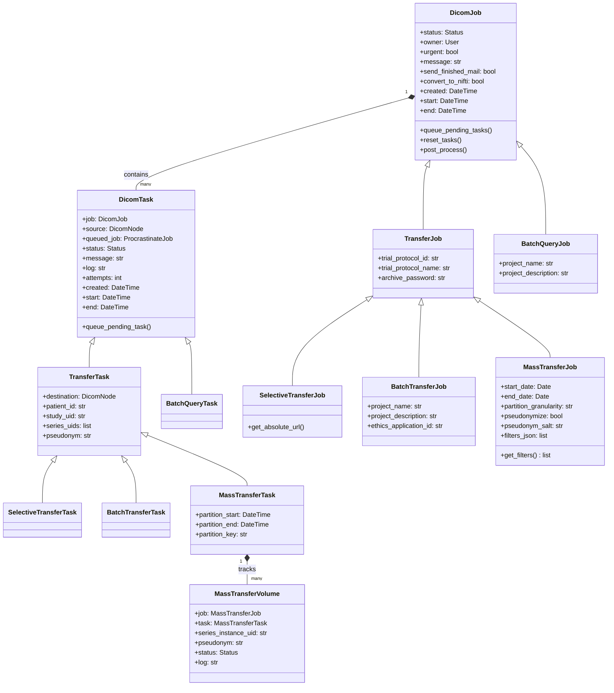
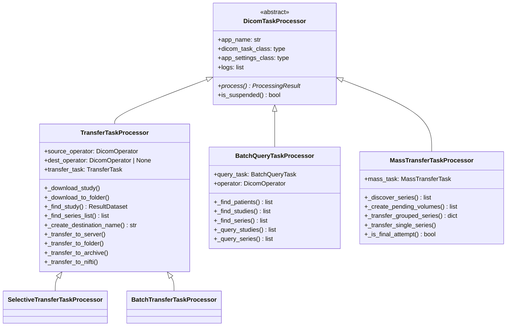

# **Core Architecture & Component Hierarchy in ADIT**

This document outlines the hierarchical architecture of the ADIT system, focusing on how core components are shared and reused across different applications (Selective Transfer, Batch Transfer, Mass Transfer, and Batch Query).

## Overview

The ADIT system follows a hierarchical architecture with the **Core App** (`adit.core`) providing foundational services and shared components. The core includes DICOM node configuration, base models, utilities, and the critical `DicomOperator` for all DICOM operations. User and group management (the `User` model, registration, token authentication) lives in the shared package `adit_radis_shared.accounts`, not in `adit.core`.

## **Core Component Hierarchy**

### 1. Model Inheritance Structure

The core provides base models that establish a consistent pattern across all DICOM applications:

```mermaid
classDiagram
    class DicomJob {
        +status: Status
        +owner: User
        +urgent: bool
        +message: str
        +send_finished_mail: bool
        +convert_to_nifti: bool
        +created: DateTime
        +start: DateTime
        +end: DateTime
        +queue_pending_tasks()
        +reset_tasks()
        +post_process()
    }

    class TransferJob {
        +trial_protocol_id: str
        +trial_protocol_name: str
        +archive_password: str
    }

    class DicomTask {
        +job: DicomJob
        +source: DicomNode
        +queued_job: ProcrastinateJob
        +status: Status
        +message: str
        +log: str
        +attempts: int
        +created: DateTime
        +start: DateTime
        +end: DateTime
        +queue_pending_task()
    }

    class TransferTask {
        +destination: DicomNode
        +patient_id: str
        +study_uid: str
        +series_uids: list
        +pseudonym: str
    }

    DicomJob "1" *-- "many" DicomTask : contains
    DicomJob <|-- TransferJob
    DicomJob <|-- BatchQueryJob
    TransferJob <|-- SelectiveTransferJob
    TransferJob <|-- BatchTransferJob
    TransferJob <|-- MassTransferJob

    DicomTask <|-- TransferTask
    DicomTask <|-- BatchQueryTask
    TransferTask <|-- SelectiveTransferTask
    TransferTask <|-- BatchTransferTask
    TransferTask <|-- MassTransferTask
    MassTransferTask "1" *-- "many" MassTransferVolume : tracks

    class SelectiveTransferJob {
        +get_absolute_url()
    }

    class BatchTransferJob {
        +project_name: str
        +project_description: str
        +ethics_application_id: str
    }

    class BatchQueryJob {
        +project_name: str
        +project_description: str
    }

    class MassTransferJob {
        +start_date: Date
        +end_date: Date
        +partition_granularity: str
        +pseudonymize: bool
        +pseudonym_salt: str
        +filters_json: list
        +get_filters() list
    }

    class MassTransferTask {
        +partition_start: DateTime
        +partition_end: DateTime
        +partition_key: str
    }

    class MassTransferVolume {
        +job: MassTransferJob
        +task: MassTransferTask
        +series_instance_uid: str
        +pseudonym: str
        +status: Status
        +log: str
    }
```

**Key Benefits:**

- **Unified Job Management**: All apps use the same job lifecycle (unverified → pending → in-progress → success/warning/failure/canceled, see [Task recovery](architecture.md#task-recovery) for how a killed worker fits in)
- **Consistent Task Processing**: Shared status tracking, retry logic, and error handling
- **Common Admin Interface**: Single admin interface for all job types through inheritance

### 2. DicomOperator - The Core DICOM Communication Hub

The `DicomOperator` class is the **central abstraction** for all DICOM operations, providing a unified interface regardless of the underlying protocol (DIMSE, DICOMweb).

#### DicomOperator Core Methods

The DicomOperator provides several key methods that are reused across all ADIT applications:

**Query Operations** - Used by all applications:

- `find_patients()` - Search for patients matching criteria
- `find_studies()` - Search for studies matching criteria _(most frequently used)_
- `find_series()` - Search for series within studies
- `find_images()` - Search for individual images

**Retrieval Operations** - Used by transfer applications:

- `fetch_study()` - Download all images in a study _(extensively reused)_
- `fetch_series()` - Download all images in a specific series
- `fetch_image()` - Download a single image

**Movement Operations** - Used by transfer applications:

- `move_study()` - Move a study between DICOM servers
- `move_series()` - Move a single series between DICOM servers
- `upload_images()` - Upload images to a destination server

**Lifecycle and Diagnostics**:

- `abort()` - Abort the running operation (used when a query or task is canceled)
- `close()` - Release the connection of a persistent operator
- `get_logs()` - Collect the log entries (e.g. warnings) produced during the operations

#### How find_studies() Works

The `find_studies()` method is the most commonly used query method across all applications. It searches for medical imaging studies on a DICOM server based on criteria like patient name, date range, or modality.

**Protocol Selection:**
The method intelligently chooses the communication protocol based on what the target server supports:

1. **DIMSE C-FIND** (traditional protocol) - Used if the server supports patient-root or study-root queries
2. **DICOMweb QIDO-RS** (modern web-based protocol) - Used as fallback if DIMSE is unavailable
3. Returns results progressively as an iterator, allowing applications to process studies as they're found

#### How fetch_study() Works

The `fetch_study()` method is extensively reused in transfer applications to download complete studies from DICOM servers. It retrieves all DICOM images belonging to a specific study.

**Protocol Selection Priority:**
The method tries protocols in order of efficiency:

1. **WADO-RS** (DICOMweb retrieval) - Preferred for modern servers, most efficient
2. **C-GET** (DIMSE retrieval) - Traditional protocol, widely supported
3. **C-MOVE** (DIMSE movement) - Legacy protocol for older systems

**Callback Processing:**
As each image is retrieved, it's immediately passed to a callback function. This allows applications to:

- Process images in real-time without waiting for the entire study
- Modify DICOM tags on-the-fly (pseudonymization, etc.)
- Save images directly to disk as they arrive
- Provide progress updates to users

### 3. Processor Architecture

All DICOM processing follows a consistent pattern through processor inheritance:

```mermaid
classDiagram
    class DicomTaskProcessor {
        <<abstract>>
        +app_name: str
        +dicom_task_class: type
        +app_settings_class: type
        +logs: list
        +process()* ProcessingResult
        +is_suspended() bool
    }

    class TransferTaskProcessor {
        +source_operator: DicomOperator
        +dest_operator: DicomOperator | None
        +transfer_task: TransferTask
        +_download_study()
        +_download_to_folder()
        +_find_study() ResultDataset
        +_find_series_list() list
        +_create_destination_name() str
        +_transfer_to_server()
        +_transfer_to_folder()
        +_transfer_to_archive()
        +_transfer_to_nifti()
    }

    class BatchQueryTaskProcessor {
        +query_task: BatchQueryTask
        +operator: DicomOperator
        +_find_patients() list
        +_find_studies() list
        +_find_series() list
        +_query_studies() list
        +_query_series() list
    }

    class MassTransferTaskProcessor {
        +mass_task: MassTransferTask
        +_discover_series() list
        +_create_pending_volumes() list
        +_transfer_grouped_series() dict
        +_transfer_single_series()
        +_is_final_attempt() bool
    }

    DicomTaskProcessor <|-- TransferTaskProcessor
    DicomTaskProcessor <|-- BatchQueryTaskProcessor
    DicomTaskProcessor <|-- MassTransferTaskProcessor
    TransferTaskProcessor <|-- SelectiveTransferTaskProcessor
    TransferTaskProcessor <|-- BatchTransferTaskProcessor
```

**Processor Responsibilities:**

- **DicomTaskProcessor**: Base processing logic, suspension handling, logging
- **TransferTaskProcessor**: Study download, transfer logic, DICOM manipulation; `dest_operator` is only set when the destination is a DICOM server (it is `None` for folder destinations)
- **BatchQueryTaskProcessor**: Large-scale DICOM queries, result aggregation
- **MassTransferTaskProcessor**: Series discovery by filter and per-series export for one partition; it subclasses `DicomTaskProcessor` directly because it needs its own transfer loop instead of the single-study flow of `TransferTaskProcessor`

**Task Claiming and Recovery:**

A processor is only ever started by `_run_dicom_task()` (`adit/core/tasks.py`) after it has claimed the task with one conditional `PENDING → IN_PROGRESS` UPDATE that also records the Procrastinate row in `DicomTask.queued_job`. Processors therefore never touch the task status themselves; they return a `ProcessingResult` (status, message, log) and the runner persists it and re-evaluates the job. Tasks left `IN_PROGRESS` by a killed worker are repaired by the stale task sweep in `adit/core/utils/recovery.py`, described in [Task recovery](architecture.md#task-recovery).

## Application-Specific Usage Patterns

### Selective Transfer - Real-time Interactive Queries

**Core Components Used:**

- `DicomOperator.find_studies()` - Real-time study searching
- `DicomOperator.fetch_study()` - Study download for transfers
- WebSocket infrastructure for real-time UI updates

#### WebSocket Architecture

The WebSocket infrastructure enables real-time communication between the browser and server, allowing for interactive DICOM query operations with immediate feedback. This is primarily used by the Selective Transfer application to provide a responsive user experience during DICOM server queries.

The WebSocket connection allows bidirectional, persistent communication between the client (browser) and server. Unlike traditional HTTP requests, WebSockets maintain an open connection, enabling the server to send updates to the client as soon as data becomes available.

**Execution pathway:**

1. **Authentication Check**: Verifies the user is logged in before allowing WebSocket connection
2. **Resource Initialization**:
   - `query_operators`: List to track active DICOM operations for potential cancellation
   - `current_message_id`: Counter to handle message ordering and prevent race conditions
   - `pool`: ThreadPoolExecutor for running blocking DICOM operations in background threads
3. **Connection Acceptance**: Establishes the WebSocket connection with the client

**Execution flow:**

1. **Create DicomOperator**: Instantiates a new DicomOperator for the specific DICOM server
2. **Track Operation**: Adds operator to the list for potential cancellation
3. **Execute Query**: Calls `query_studies()` which uses `DicomOperator.find_studies()` under the hood
4. **Progressive Streaming**: As each study is found:
   - Adds it to the results list
   - Checks if this query is still current (not cancelled)
   - Immediately sends updated results to the browser via WebSocket

**User searches for studies containing "MRI" and PatientName "Smith":**

1. **Browser** → Sends JSON: `{"action": "query", "patient_name": "Smith", "modality": "MR"}`
2. **WebSocket Consumer** → Creates DicomOperator, increments message_id to 123
3. **DicomOperator** → Queries DICOM server using C-FIND or QIDO-RS
4. **First study found** → WebSocket sends: `{"studies": [study1], "message_id": 123}`
5. **Browser** → Updates UI immediately with study1
6. **Second study found** → WebSocket sends: `{"studies": [study1, study2], "message_id": 123}`
7. **Browser** → Updates UI with both studies
8. **All studies found** → WebSocket sends: `{"studies": [study1, study2, study3], "complete": true}`

**If user starts new search before completion:**

- message_id increments to 124
- Old query (123) results are ignored
- New query (124) results are displayed immediately

### Batch Transfer - Bulk Background Processing

**Core Components Used:**

- `DicomOperator.find_studies()` - Study validation
- `DicomOperator.fetch_study()` - Bulk study downloads
- `TransferTaskProcessor` - Background processing

**Bulk Operations:**

- Processes multiple studies per job
- Background task queue processing
- CSV file parsing for bulk study definitions
- Progress tracking across multiple tasks

### Batch Query - Large-scale DICOM Queries

**Core Components Used:**

- `DicomOperator.find_patients()` - Patient discovery
- `DicomOperator.find_studies()` - Study enumeration
- `DicomOperator.find_series()` - Series-level queries
- Custom result aggregation

### Mass Transfer - Filter-driven Bulk Export

**Core Components Used:**

- `DicomOperator.find_studies()` / `find_series()` - Series discovery (a persistent operator per task)
- `DicomOperator.fetch_series()` - Per-series download
- `Pseudonymizer` - Deterministic (salted) or random pseudonyms
- `DicomTaskProcessor` - Background processing with a custom transfer loop

**Partitioning:** When a `MassTransferJob` is created, its date range is split by `build_partitions()` (`adit/mass_transfer/utils/partitions.py`) into daily or weekly windows, and one `MassTransferTask` is created per window (`partition_start`, `partition_end`, `partition_key`). Queuing thousands of tasks is deferred to the `queue_mass_transfer_tasks` job on the `default` queue so the HTTP request returns immediately; the tasks themselves run on the `mass_transfer` queue.

**Filters:** `MassTransferJob.filters_json` holds a list of filter objects that are parsed into `FilterSpec` dataclasses (`adit/mass_transfer/processors.py`). Each spec is either an `include` or an `exclude` filter with criteria such as modality, institution name, study/series description, series number, patient age range, and minimum number of instances per series. At least one include filter is required; each include filter is turned into C-FIND queries for the partition window (windows that hit `DicomServer.max_search_results` are split recursively), and the resulting series are then dropped if they match any exclude filter.

**Volumes:** Every discovered series becomes a `MassTransferVolume` (`PENDING`) before any data moves, so progress is visible in the UI immediately. Volumes are grouped by patient and study and exported one series at a time to a folder (optionally converted to NIfTI) or to a destination server; each volume ends as `EXPORTED`, `CONVERTED`, `SKIPPED`, or `ERROR`. On a retry the partition's volumes and output folder are deleted and rebuilt.

**Final-attempt behavior:** A `RetriableDicomError` for a single series normally aborts the task so Procrastinate retries the whole partition. `_is_final_attempt()` compares `DicomTask.attempts` with `DICOM_TASK_MAX_ATTEMPTS`; on the last attempt the failing volume is marked `ERROR` and the loop continues with the remaining series, so the task finishes as `WARNING` instead of failing the entire partition because of one dead series.

## Shared Utility Components

### DicomOperator Factory Pattern

The DicomOperator is instantiated on-demand by each application component when DICOM communication is needed. Rather than maintaining long-lived operator instances, applications create operators as needed by passing a DicomServer configuration object to the constructor.

**Usage across applications:**

- **Selective Transfer**: WebSocket consumers create operators for each real-time query session
- **Batch Transfer**: Task processors create separate source and destination operators for each transfer task
- **Batch Query**: Task processors create a single operator instance to query the configured source server
- **Mass Transfer**: Task processors create a persistent source operator per partition (closed after discovery and after the transfer) plus a destination operator when the destination is a server

This factory pattern ensures each operation has a properly configured operator without coupling applications to specific operator instances or lifecycle management.

### Common Query Patterns

All applications construct DICOM queries using a consistent `QueryDataset` interface that abstracts DICOM query parameters; `QueryDataset` and `ResultDataset` are defined in `adit/core/utils/dicom_dataset.py`. The query creation follows DICOM's hierarchical model with fields like PatientID and StudyInstanceUID combined with a QueryRetrieveLevel specification.

**Standard study-level queries** include the patient identifier, study instance UID (when known), and explicitly set the retrieve level to "STUDY". This pattern is used universally across selective transfer, batch transfer, and batch query applications. The DicomOperator's `find_studies()` method processes these standardized queries and returns matching studies as iterable results.

This consistency ensures predictable behavior and allows operators to optimize queries based on the retrieve level and available search parameters.

### Callback-based Data Processing

All fetch operations (study downloads, series retrieval) use a callback-driven architecture for processing DICOM datasets as they stream from the source server. Rather than downloading complete studies before processing, applications provide callback functions that receive each DICOM image dataset immediately upon arrival.

**Callback responsibilities** include real-time dataset modification (such as pseudonymization by changing DICOM tags), saving images to disk as they arrive, and providing incremental progress updates to users. This streaming approach is used by all transfer operations to enable efficient memory usage and responsive progress tracking.

The callback pattern allows applications to implement custom processing logic without modifying the core retrieval mechanisms in DicomOperator.

## Development Guidelines

### When to Use Each Component

**Use DicomOperator when:**

- Performing any DICOM server communication
- Need protocol abstraction (DIMSE vs DICOMweb)
- Implementing query/retrieve/move operations

**Use TransferTaskProcessor when:**

- Building new transfer-based applications
- Need study download/upload capabilities
- Require DICOM manipulation during transfer

**Use DicomTaskProcessor when:**

- Building new DICOM applications
- Need background task processing
- Require job/task lifecycle management

**Use WebSocket Consumer when:**

- Need real-time user interaction
- Progressive result updates required
- Interactive query/transfer workflows

### Extension Points

**Adding New Transfer Apps:**

1. Inherit from `TransferJob` and `TransferTask` models
2. Create processor inheriting from `TransferTaskProcessor`
3. Leverage existing `DicomOperator.fetch_study()` functionality

A processor may subclass `DicomTaskProcessor` directly when it needs its own transfer loop instead of the one-study-per-task flow of `TransferTaskProcessor` (as `MassTransferTaskProcessor` does); it still runs through the same task runner, queue, and recovery machinery.

**Adding New Query Apps:**

1. Inherit from `DicomJob` and `DicomTask` models
2. Create processor inheriting from `DicomTaskProcessor`
3. Use appropriate `DicomOperator.find_*()` methods

**Adding Real-time Features:**

1. Create WebSocket consumer similar to `SelectiveTransferConsumer`
2. Use `DicomOperator` for DICOM operations
3. Implement progressive result streaming

This architecture ensures that each application leverages the core components effectively while maintaining clean separation of concerns and maximum code reuse.
