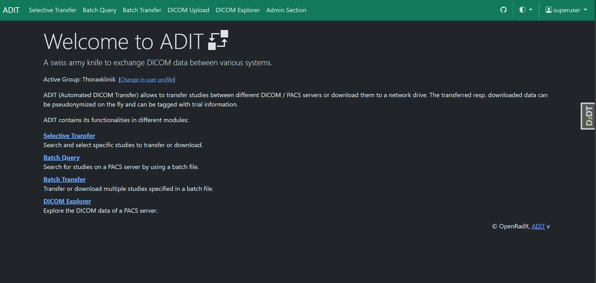
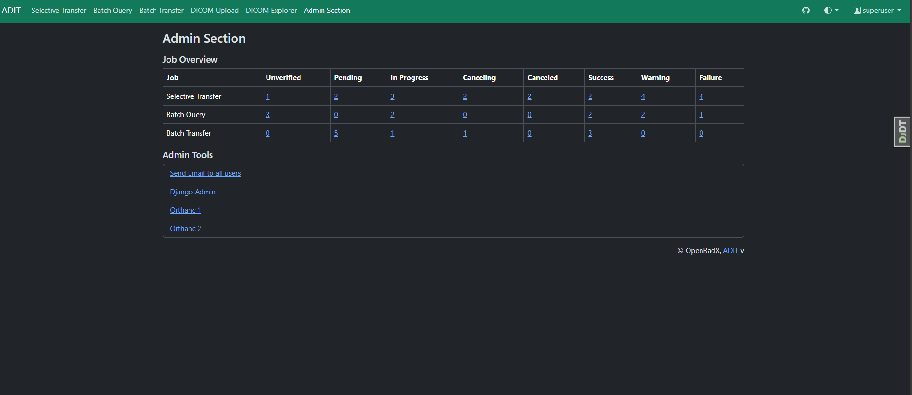

---
hide:
  - toc
  - navigation
---

# **ADIT - Automated DICOM Transfer**

  

    

      
    

    

      
    

    

      
    

    

      
    

  

<a class="prev" onclick="changeSlide(-1)">❮</a>
<a class="next" onclick="changeSlide(1)">❯</a>

  

    
    
    
    
  

ADIT acts as an intelligent bridge between traditional DICOM systems and modern applications, enabling secure, controlled, and privacy-preserving medical imaging data transfer.

Traditional PACS and DICOM systems rely on specialized protocols that are not directly compatible with modern web applications. ADIT solves this challenge by acting as a translator between web-friendly APIs and native DICOM protocols—without requiring changes to existing PACS configurations.

## Request and Response Workflow

ADIT simplifies interaction with DICOM systems through the following process:

- You send a simple web request, similar to interacting with any standard REST API.

- ADIT translates the web request into traditional DICOM commands.

- ADIT communicates with the PACS using its native DICOM protocols.

- The PACS response is converted by ADIT into a web-friendly format.

- You receive easy-to-use JSON metadata or DICOM files.

## About

## Developed at

[CCI Bonn](https://ccibonn.ai/) - Center for Computational Imaging, University Hospital Bonn

## Partners

- [Universitätsklinikum Bonn](https://www.ukbonn.de/)
- [Thoraxklinik Heidelberg](https://www.thoraxklinik-heidelberg.de/)
- [Universitätsklinikum Heidelberg](https://www.klinikum.uni-heidelberg.de/kliniken-institute/kliniken/diagnostische-und-interventionelle-radiologie/klinik-fuer-diagnostische-und-interventionelle-radiologie/)

!!! important "Beta Status"
ADIT is currently in early beta stage. While we are actively building and refining its features, users should anticipate ongoing updates and potential breaking changes as the platform evolves. We appreciate your understanding and welcome feedback to help us shape the future of ADIT.

**Admin Guide**: Explore system administration, configuration, and management features in the [Admin Guide](user-docs/admin-guide.md)

**User Guide**: Explore the application’s features, and how to execute common workflows in a clear and practical manner in our [User Guide](user-docs/user-guide.md)
