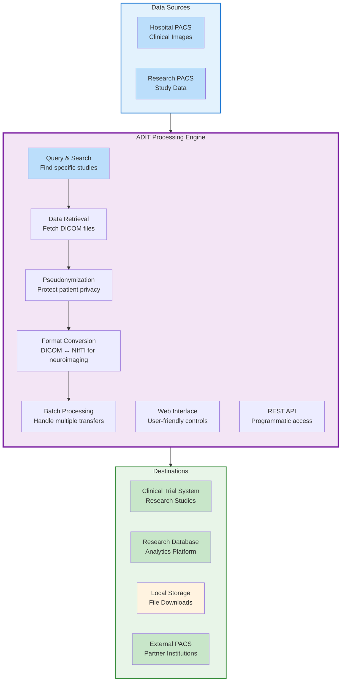

# ADIT - Automated DICOM Transfer

ADIT (Automated DICOM Transfer) is a Swiss army knife to exchange DICOM data between various systems by using a convenient web frontend.

## Why ADIT?

Medical imaging workflows today face significant challenges when moving DICOM data between different systems. ADIT addresses these critical pain points.

## What ADIT Does

ADIT serves as a central hub for medical imaging data, connecting various DICOM systems and enabling secure, controlled data exchange with modern web technologies.

### How It Works

**ADIT acts as an intelligent bridge** between traditional DICOM systems and modern applications:

1. **Data Discovery**: Connect to multiple PACS systems and search for studies using familiar web interfaces
2. **Secure Retrieval**: Fetch DICOM data using established hospital protocols while maintaining security
3. **Privacy Protection**: Automatically pseudonymize patient data during transfer to protect privacy
4. **Format Conversion**: Convert DICOM images to NIfTI format for neuroimaging research and analysis
5. **Modern Access**: Provide web-friendly APIs that work with any programming language or web application
6. **Automated Processing**: Handle single transfers or batch operations with full audit trails

**Perfect for**: Research institutions, clinical trials, multi-site studies, neuroimaging research, and any scenario requiring secure DICOM data exchange between different systems.

### **NIfTI Conversion Capabilities**

ADIT includes built-in support for converting DICOM images to **NIfTI (Neuroimaging Informatics Technology Initiative)** format, making medical imaging data accessible to a wide range of neuroimaging and research tools.

**Use Cases:**

- **Functional MRI (fMRI)** analysis and brain activation mapping
- **Structural MRI** analysis including volumetric measurements
- **Diffusion Tensor Imaging (DTI)** and white matter tractography
- **Machine Learning** applications with standardized input format
- **Multi-site studies** with consistent data format across institutions
- **Longitudinal studies** tracking brain changes over time

**Key Benefits:**

- **Automated conversion** during transfer - no manual processing required
- **Maintains image quality** and spatial information from original DICOM
- **Preserves metadata** for research traceability
- **Cross-platform compatibility** works on Windows, macOS, and Linux
- **Integration ready** for research pipelines and analysis workflows

Simply enable the "Convert to NIfTI" option during selective or batch transfers, and ADIT will automatically generate research-ready NIfTI files alongside or instead of DICOM data.

**Ready to modernize your medical imaging workflows?** ADIT bridges the gap between traditional DICOM infrastructure and modern application development, making medical imaging data as accessible as any other web API.

## About

## Developed at

[CCI Bonn](https://ccibonn.ai/) - Center for Computational Imaging, University Hospital Bonn

## Partners

- [Universitätsklinikum Bonn](https://www.ukbonn.de/)
- [Thoraxklinik Heidelberg](https://www.thoraxklinik-heidelberg.de/)
- [Universitätsklinikum Heidelberg](https://www.klinikum.uni-heidelberg.de/kliniken-institute/kliniken/diagnostische-und-interventionelle-radiologie/klinik-fuer-diagnostische-und-interventionelle-radiologie/)

!!! important "Beta Status"
ADIT is currently in early beta stage. While we are actively building and refining its features, users should anticipate ongoing updates and potential breaking changes as the platform evolves. We appreciate your understanding and welcome feedback to help us shape the future of ADIT.

## Quick Start. **Getting Started**: Learn the basics in our [getting started guide](user-docs/getting-started.md)

2. **User Guide**: Explore features in our [user guide](user-docs/user-guide.md)
3. **Development**: Contribute to the project with our [development guide](dev-docs/development-setup.md)

## Getting Help

- Browse the [user documentation](user-docs/user-guide.md)
- Report issues on [GitHub](https://github.com/openradx/adit/issues)
- 💬 Join the discussion in [GitHub Discussions](https://github.com/openradx/adit/discussions)

## Upcoming features

- An upload portal to upload DICOM images through a web interface that can be pseudonymized on the client (before the transfer happens)

## License

ADIT is licensed under the [AGPL-3.0-or-later](https://github.com/openradx/adit/blob/main/LICENSE) license.
