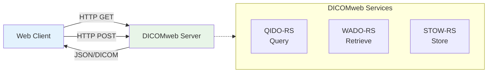
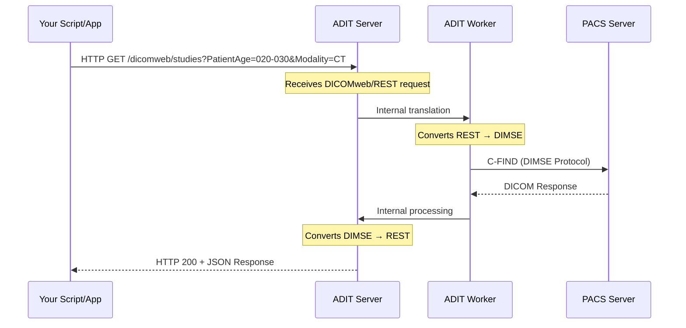

# Technical Overview: Bridging DICOM and Web Technologies

## The Challenge: Traditional DICOM vs Modern Web Workflows

Many existing PACS servers, while robust, rely on older, specialized DICOM protocols (DIMSE) and often have web-based access (like DICOMweb) either not implemented or explicitly turned off for security reasons. This creates a significant hurdle for modern applications, especially those built for the web or requiring automated, scriptable access.

**ADIT (Automated DICOM Transfer)** acts as an intelligent intermediary, a "translator" or "proxy," that allows you to interact with your medical imaging data using familiar web technologies, even if the underlying PACS does not natively support them.

## DICOM Protocol Overview

### Traditional DICOM Protocols (DIMSE)

Traditional DICOM communication relies on DIMSE (DICOM Message Service Element) services:

- **C-FIND (Query):** Search for studies, series, or instances based on criteria
- **C-GET (Retrieve - Pull):** Client requests and "pulls" images directly
- **C-MOVE (Retrieve - Push):** Instructs server to "push" images to another destination
- **C-STORE (Store):** Send DICOM images to a server

These protocols operate over dedicated TCP/IP connections and require specialized DICOM toolkits.

### DICOMweb Protocols (RESTful APIs)

DICOMweb standardizes web-based access to DICOM data using RESTful principles:

- **QIDO-RS:** Query using HTTP GET with URL parameters
- **WADO-RS:** Retrieve using HTTP GET requests
- **STOW-RS:** Store using HTTP POST requests

## How ADIT Bridges the Gap

ADIT acts as a **translation layer** between modern web APIs and traditional DICOM protocols:

### The Translation Process

1. **Receiving Web Requests:** ADIT receives standard HTTP/HTTPS DICOMweb requests
2. **Internal Translation:** Converts DICOMweb/REST requests into DIMSE commands
3. **PACS Communication:** Communicates with PACS using native DIMSE protocols
4. **Response Translation:** Converts DICOM data back to web-friendly format
5. **Web Response:** Returns JSON/DICOM data over HTTP/HTTPS

## Security Benefits

ADIT addresses common security concerns:

### Centralized Security Model

- **Single Point of Control:** Secure ADIT instead of exposing multiple PACS endpoints
- **Authentication & Authorization:** Implement fine-grained access controls
- **Network Isolation:** PACS can remain on internal networks

### Traditional PACS Security Maintained

- **No DICOMweb Exposure:** PACS doesn't need web services enabled
- **Existing Security:** Maintains traditional DICOM security (AET whitelisting)
- **Controlled Access:** ADIT acts as a secure proxy

### Data Protection

- **On-the-fly Pseudonymization:** Automatic data anonymization during transfer
- **Audit Logging:** Complete transfer and access history
- **Encryption:** HTTPS for all web communications
