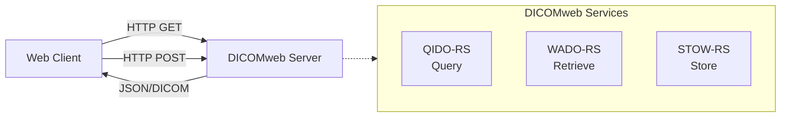
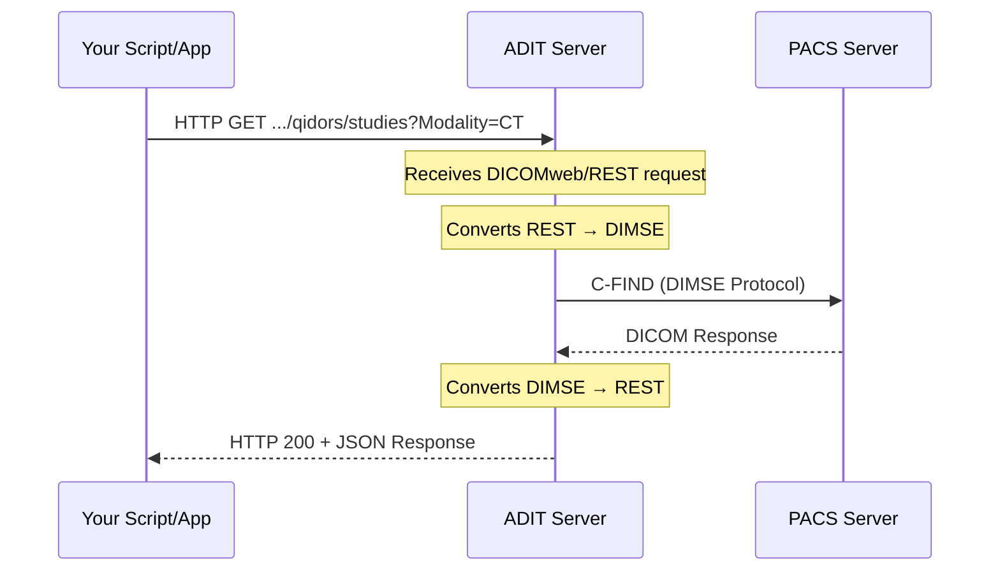

# Technical Overview: Bridging DICOM and Web Technologies

## The Challenge: Traditional DICOM vs Modern Web Workflows

Many existing PACS servers, while robust, rely on older, specialized DICOM protocols (DIMSE) and often have web-based access (like DICOMweb) either not implemented or explicitly turned off for security reasons. This creates a significant hurdle for modern applications, especially those built for the web or requiring automated, scriptable access.

**ADIT (Automated DICOM Transfer)** acts as an intelligent intermediary, a "translator" or "proxy," that allows you to interact with your medical imaging data using familiar web technologies, even if the underlying PACS does not natively support them.

## DICOM Protocol Overview

### Traditional DICOM Protocols (DIMSE)

Traditional DICOM communication relies on DIMSE (DICOM Message Service Element) services:

- **C-FIND (Query):** Search for studies, series, or instances based on criteria
- **C-GET (Retrieve - Pull):** Client requests and "pulls" images directly
- **C-MOVE (Retrieve - Push):** Instructs server to "push" images to another destination
- **C-STORE (Store):** Send DICOM images to a server

These protocols operate over dedicated TCP/IP connections and require specialized DICOM toolkits.

### DICOMweb Protocols (RESTful APIs)

DICOMweb standardizes web-based access to DICOM data using RESTful principles:

- **QIDO-RS:** Query using HTTP GET with URL parameters
- **WADO-RS:** Retrieve using HTTP GET requests
- **STOW-RS:** Store using HTTP POST requests

ADIT exposes these services under `/api/dicom-web/{ae_title}/qidors/`, `/api/dicom-web/{ae_title}/wadors/` and `/api/dicom-web/{ae_title}/stowrs/`, where `{ae_title}` is the AE title of the DICOM server configured in ADIT.

When ADIT has to fetch the data from a server via C-MOVE, it requests images that did not arrive again, one at a time, for up to `C_MOVE_REFETCH_ATTEMPTS` rounds (not when none of them arrived or more than `C_MOVE_REFETCH_MAX_MISSING_PERCENT` of them are missing; then the retrieval fails right away), and fails a retrieval that is still incomplete afterwards (unless `C_MOVE_FAIL_ON_INCOMPLETE=false`). A WADO-RS response then does not silently miss images. A streamed DICOM response has already started with status 200 by then, so its multipart body ends with a `text/plain` part carrying the error message, which DICOMweb clients cannot read as DICOM. The metadata resources collect all images first and fail with HTTP 503, as do the NIfTI resources when the incomplete series is the first one they convert. The re-fetch can make such a response take noticeably longer. A retrieval also fails when ADIT's DICOM receiver doesn't confirm the delivery in time (after 120 s without progress).

#### NIfTI Retrieval

In addition to the standard WADO-RS resources, ADIT offers non-standard `/nifti` resources that return the retrieved data converted to NIfTI (using [dcm2niix](https://github.com/rordenlab/dcm2niix)) instead of DICOM:

- `/api/dicom-web/{ae_title}/wadors/studies/{study_uid}/nifti`
- `/api/dicom-web/{ae_title}/wadors/studies/{study_uid}/series/{series_uid}/nifti`
- `/api/dicom-web/{ae_title}/wadors/studies/{study_uid}/series/{series_uid}/instances/{image_uid}/nifti`

The response is a multipart message containing, per converted series, the NIfTI file together with the JSON sidecar and (if present) the bval and bvec files written by dcm2niix. The ADIT Client provides `retrieve_nifti_study`, `retrieve_nifti_series` and `retrieve_nifti_image` for these resources.

## How ADIT Bridges the Gap

ADIT acts as a **translation layer** between modern web APIs and traditional DICOM protocols:

### The Translation Process

1. **Receiving Web Requests:** ADIT receives standard HTTP/HTTPS DICOMweb requests
2. **Internal Translation:** Converts DICOMweb/REST requests into DIMSE commands
3. **PACS Communication:** Communicates with PACS using native DIMSE protocols
4. **Response Translation:** Converts DICOM data back to web-friendly format
5. **Web Response:** Returns JSON/DICOM data over HTTP/HTTPS

## Security Benefits

ADIT addresses common security concerns:

### Centralized Security Model

- **Single Point of Control:** Secure ADIT instead of exposing multiple PACS endpoints
- **Authentication & Authorization:** Implement fine-grained access controls
- **Network Isolation:** PACS can remain on internal networks
