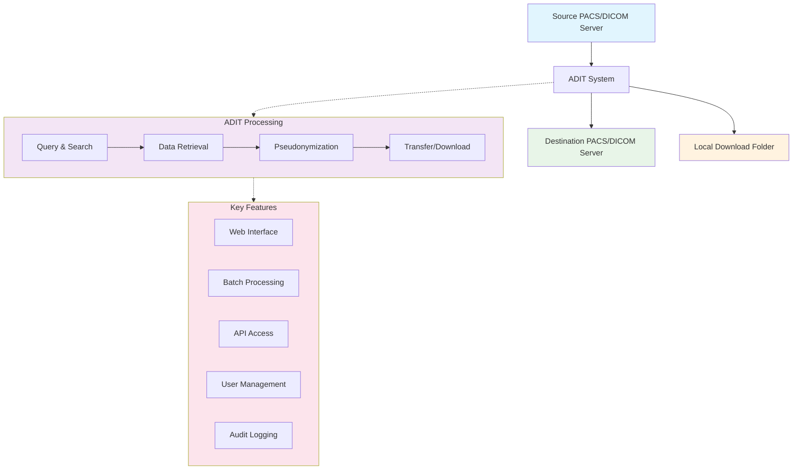
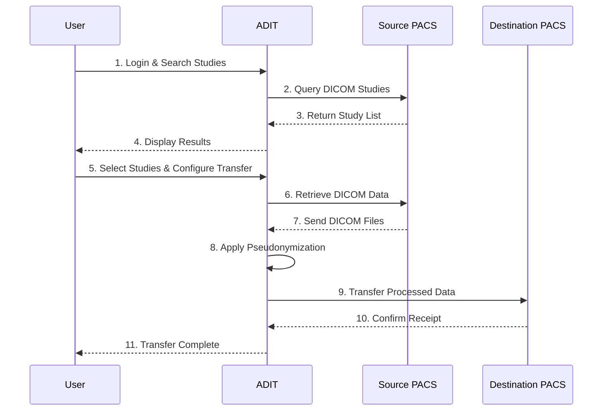

# User Guide

This guide covers the main features and workflows in ADIT from a user perspective.

## How ADIT Works

ADIT acts as a bridge between different DICOM systems, enabling secure and controlled data transfer with built-in pseudonymization capabilities.

### The Challenge ADIT Solves

Many hospital PACS systems use traditional DICOM protocols (DIMSE) but don't support modern web-based access (DICOMweb) for security reasons. This makes it difficult to:

- Build modern web applications that need DICOM data
- Write simple scripts for research workflows
- Integrate DICOM data with other systems

### ADIT as a Translation Layer

ADIT solves this by acting as a "translator" that converts between web-friendly APIs and traditional DICOM protocols:

!!! info "How the Translation Works" 1. **You send** a simple web request (like getting data from any website) 2. **ADIT translates** your request into traditional DICOM commands 3. **ADIT communicates** with your PACS using its native protocols 4. **ADIT converts** the response back to web-friendly format 5. **You receive** easy-to-use JSON data or DICOM files

This means your PACS can stay secure with its existing configuration, while you get modern web access through ADIT.

## Data Flow Overview

## Dashboard Overview

When you log into ADIT, you'll see the main dashboard with several sections:

- **Selective Transfers**: Search and select specific studies to transfer or download.
- **Batch Query**: Search for studies on a PACS server by using a batch file.
- **Batch Transfer**: Transfer or download multiple studies specified in a batch file.
- **DICOM Explorer**: Explore the DICOM data of a PACS server

## Main Workflows

### 1. Single Study Transfer

To transfer a single DICOM study:

1. Navigate to the "Selective Transfer" section
2. Select your source DICOM server
3. Enter search criteria (Patient ID, Study Date, etc.)
4. Browse and select the study you want to transfer
5. Choose your destination server
6. Configure transfer options (pseudonymization, trial name, etc.)
7. Start the transfer

### 2. Batch Operations

For transferring multiple studies:

1. Prepare a batch file
2. Go to "Batch Transfer" section
3. Upload your batch file
4. Review the detected studies
5. Configure global transfer settings
6. Start the batch transfer

### 3. Download Studies

To download DICOM studies to a local folder:

1. Search for the desired studies
2. Select "Download" instead of "Transfer"
3. Choose the download location
4. Start the download process

## User Interface Elements

### Search Filters

- **Patient ID**: Search by patient identifier
- **Patient Name**: Search by patient name
- **Study Date**: Filter by study date range
- **Modality**: Filter by imaging modality (CT, MRI, etc.)
- **Accession Number**: Search by accession number

### Transfer Options

- **Pseudonymization**: Enable/disable data anonymization
- **Trial Name**: Add a trial identifier to DICOM headers
- **Priority**: Set transfer priority level
- **Schedule**: Set when the transfer should occur
